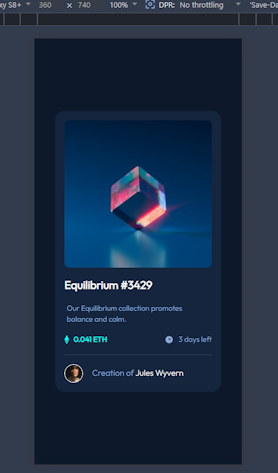
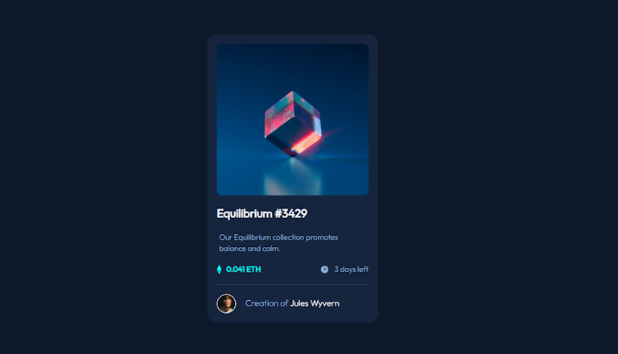

# Frontend Mentor - NFT preview card component solution

This is a solution to
the [NFT preview card component challenge on Frontend Mentor](https://www.frontendmentor.io/challenges/nft-preview-card-component-SbdUL_w0U).
Frontend Mentor challenges help you improve your coding skills by building
realistic projects.

## Table of contents

- [Overview](#overview)
   - [Screenshot](#screenshot)
   - [Links](#links)
- [My process](#my-process)
   - [Built with](#built-with)
   - [What I learned](#what-i-learned)
- [Author](#author)

## Overview

### Screenshot

#### Mobile view



#### Desktop view



### Links

- Solution URL: https://github.com/FJSolutions/fm-nft-preview-card-component
- Live Site URL: https://fbj-nft-preview-card-component.netlify.app/

## My process

### Built with

- Semantic HTML5 markup
- CSS custom properties
- Flexbox
- Mobile-first workflow
- [LightningCSS](https://lightningcss.dev/) - For CSS

### What I learned

It was great to just just HTML and CSS and no JavaScript for a project so that I
could focus on just the BEM aspect of the CSS. I used `lightningcss` as my css
pre-processor as it provides the ability to easily divide the `css` files
modularly (like in SMACSS - or more properly, ITCSS) and adds support for
`@custom-media` variables.

I didn't follow BEM to the letter; but I am sold on it as a methodology. It
simplified (read flattened) the CSS and made both the CSS and HTML more
readable. I ran into no specificity problems &ndash; though the project wasn't
complicated.

As you can see below I did use th nesting of an element within a BEM class (in
this case the `:hover` style of the class), but Kevin Powell in his video on
[Why I use the BEM naming convention for my CSS](https://youtu.be/SLjHSVwXYq4)
indicates something similar.

This code also contains deriving an `hsla` color from and `hasl` variable in
standard CSS.

```css

.card__image:hover > .card__image--view {
   display: flex;
   align-items: center;
   justify-content: center;
   position: absolute;
   z-index: 1;
   background-color: hsla(from var(--Cyan-400) h s l / 50%);
   top: 0;
   left: 0;
   right: 0;
   bottom: 0;
   border-radius: 0.5rem;

   img {
      width: 3rem;
      height: 3rem;
   }
}

```

## Author

- Frontend Mentor &ndash; [Francis Judge](https://www.frontendmentor.io/profile/FJSolutions)

## LightningCSS

This is a reminder for setting up LightningCSS in a project.

### Dependencies

```shell
pnpm add lightningcss browserslist -D
```

### Configuration

```shell
touch vite.config.ts
```
#### Config file contents

```ts
import { browserslistToTargets } from 'lightningcss';
import browserslist from 'browserslist';

export default {
   css: {
      transformer: 'lightningcss',
      lightningcss: {
         targets: browserslistToTargets(browserslist('>= 0.25%')), // Target older browsers
        drafts: {
          customMedia: true
        }
      }
   },
   build: {
      cssMinify: 'lightningcss', // Use Lightning CSS for minification
   }
};

```